# Extension WanaDoc

Les documents à destination de vos clients et fournisseurs véhiculent votre image de marque et leur lisibilité est essentielle.

C’est donc un sujet important mais souvent très chronophage.

Cette extension vise à vous fournir des documents prêts à l’emploi que vous pourrez cependant personnaliser par vous-même si nécessaire moyennant un peu d’expertise Word.

- [Présentations Word (WordLayout)](#présentations-word-wordlayout)
  - [Nouvelles balises](#nouvelles-balises)
    - [En-tête](#en-tête)
    - [Lignes](#lignes)
    - [Fin de document](#fin-de-document)
    - [Pied de page](#pied-de-page)
    - [Textes début et fin](#textes-début-et-fin)
    - [Balises complémentaires](#balises-complémentaires)
  - [Configuration](#configuration)
    - [Ventes](#ventes)
    - [Achats](#achats)
- [MemoPad](#memopad)
  - [Texte étendu](#texte-étendu)
  - [Lignes attachées](#lignes-attachées)
  - [Impression](#impression)
  - [Relances](#relances)
- [Export/Import Excel](#exportimport-excel)
- [Acomptes](#acomptes)
- [Commandes-cadres (ventes et achats)](#commandes-cadres-ventes-et-achats)
  - [Utilisation sur les documents](#utilisation-sur-les-documents)
  - [Copier lignes cmde. cadre](#copier-lignes-cmde-cadre)
- [Divers](#divers)
  - [Libellé écriture](#libellé-écriture)
  - [Quantité](#quantité)
  - [Document entrant](#document-entrant)

## Présentations Word (WordLayout)
Les modèles standards sont adaptés aux cas simples mais s’avèrent souvent incomplets.

Ainsi par exemple, les modèles proposés pour les factures sont peu adapté aux désignations longues et les lignes de commentaires n’y sont pas reprises :

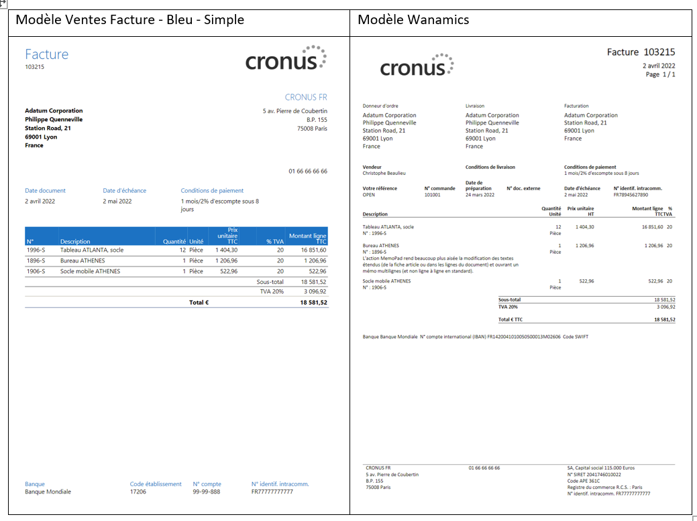

De nouvelles balises (de préfixe ‘wan’) viennent allonger la liste des informations disponibles en **Mappage XML** pour les présentations personnalisées des documents d’achats et de vente :

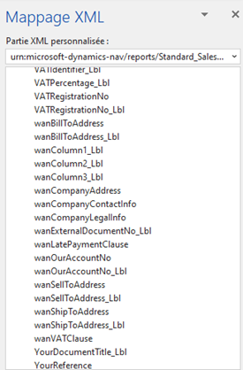

### Nouvelles balises
L’étiquette correspondante (de suffixe ‘_Lbl’), est généralement laissée vide si l’information associée n’est pas renseignée (ex :  **N° doc. externe**).

Certaines d’entre elles regroupent plusieurs informations sous une même balise pour ne former qu’un seul contrôle à placer sur le modèle et dont la hauteur pourra ainsi être ajustée (en particulier pour les adresses).

Seules quelques-unes, applicables à la facture vente, sont décrites ci-dessous (dans l’ordre du modèle illustré plus haut) :

#### En-tête

|||
|-|-|
wanSellToAddress, wanShipToAddress, wanBillToAddress	|Adresses du donneur d’ordre, de livraison et de facturation (formatées tel que défini pour le pays concerné).
wanMemoPad	|Regroupe les informations suivantes qui peuvent ainsi être reprise dans une unique colonne : **Description** de la ligne ; **N° référence d’article** suivies de **Nomenclature produit** et **Code pays/région origine** de la fiche article le cas échéant (obligatoires en cas d’opération intracommunautaire) et des  **N° série**/**N° lot** le cas échéant ; Références des livraisons (date et N° B.L.) et enfin concaténation des **Description** des lignes attachées ou à défaut, du texte étendu de l’article/compte/ressource.

#### Lignes

|||
|-|-|
wanQuantity_UOM	|Regroupe **Quantité** et **Unité** qui peuvent ainsi figurer dans une colonne unique.
wanLineDiscPercent	|**% remise ligne**
wanColumn1, 2 et 3	|Correspondent respectivement à **Quantité**, **Prix unitaire** et **Remise ligne** pour une facture standard, ou à **Mnt. commande**, **Montant acompte** et **Mnt. acompte fact.** pour une facture d’acompte (Cf. [Acomptes](#acomptes)).

#### Fin de document

* Clause TVA : *wanVATClause*

    Exemple :

    

    Reprend le texte de la **Clause TVA** associé au **Groupe compta. marché TVA** de l’en-tête combiné avec un **Groupe compta produit TVA** vide (il n’est pas tenu compte des groupes compta TVA des lignes) :

    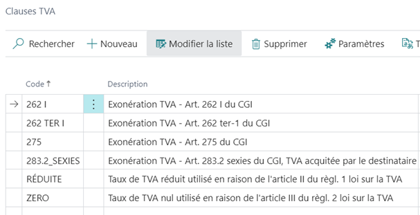

* Indemnité de recouvrement *wanLatePaymentClause*

    Exemple :

    

    La mention imprimée reprend le texte étendu associé au **Code texte retard de paiement** ajouté au **Groupe compta. marché** :

    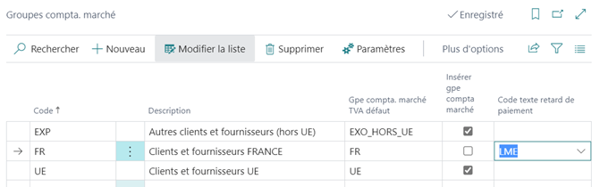

#### Pied de page

|||
|-|-|
wanCompanyAddress	|Adresses de la société (formatée tel que défini pour le pays concerné).
wanCompanyContactInfo	|**N° téléphone**, **E-mail** et **Page d’accueil** des **Informations société**
wanCompanyLegalInfo	|**Forme juridique**, **Capital social**, **N° Siret**, **Code APE**, **Registe du commerce**, **N° identif. intracomm.** des **Informations société**.

#### Textes début et fin
Ils sont principalement destinés au corps de message et complètent les balises standards (section LetterText : GreetingText, BodyText, ClosingText).

|||
|-|-|
wanBeginningContent	|Cf. configuration des textes
wanEndingText	|idem

Ces textes sont définis depuis la page **Présentations personnalisées** via l’action **Contenus document** et sont applicables à toutes les présentations de l’état auquel ils sont associés.

Exemple:

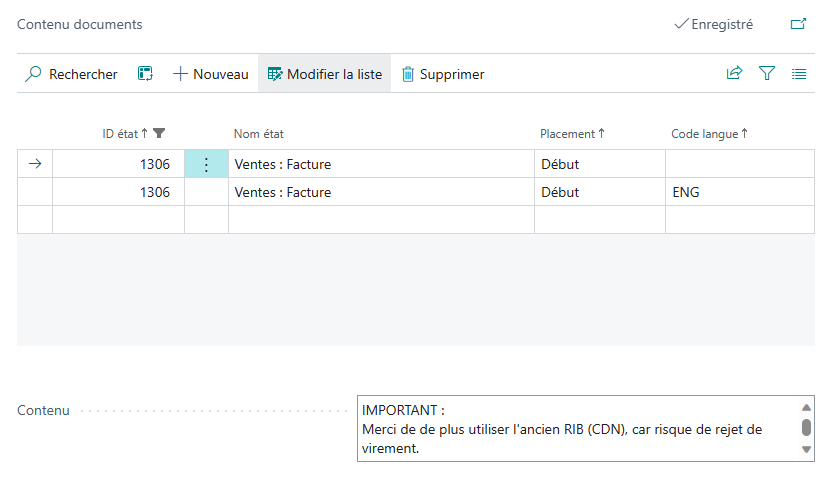

#### Balises complémentaires
Les balises ci-après sont applicables à d’autres documents :

|||
|-|-|
wanVersion	|Préfixe *R* suivi du **Nbre versions archivées** (vide si aucune version archivée).
wanPaymentMethodText|Reprend la désignation du mode de règlement complétée des coordonnées bancaires de la société et du N° de mandat le cas échéant.|

### Configuration
Vous devrez alors sélectionner l’état et la présentation souhaitée (Cf. [Soignez votre image avec des états personnalisés – Wanamics](https://www.wanamics.fr/soignez-votre-image-avec-des-etats-personnalises/)) parmi les suivants :

#### Ventes	 
* Devis (1304)	 
* Commande cadre vente (87300)	
* Confirm. commande vente (1305)	 
* Facture proforma (1302)	 
* Bon de livraison (1308)	 
* Facture vente (1306)	 
* Avoir vente (1307)	 

#### Achats	 
* Demande de prix (87304)	 
* Commande cadre achat (87310)	 
* Commande achat (1322)	 

Rappelons qu’avec un peu de persévérance, il est possible de reprendre un WordLayout d’un document pour l’appliquer à un document similaire (Cf.  [Devis, commandes, factures à votre image – Wanamics](https://www.wanamics.fr/devis-commandes-factures-a-votre-image/)).

## MemoPad
La version standard permet de définir des textes étendus, en particulier pour les articles (mais également pour les ressources et les comptes du plan comptable).

Des lignes de commentaires sont alors insérées à la suite de ce dernier sur les documents d’achats et de ventes et liées à celle-ci (**Attached to Line No.** du volet **Contrôle de page**).

Si l’option **Textes étendus automatique** n’a pas été retenue sur la fiche article/compte/ressource, vous pourrez les insérer par l’action **Insérer textes étendus**.

L’action MemoPad rend beaucoup plus aisée la modification des textes étendus (de la fiche article ou dans les lignes du document) et ouvrant un mémo multilignes (contrairement à la saisie ligne à ligne dans la limite de 100 caractères en standard).

### Texte étendu

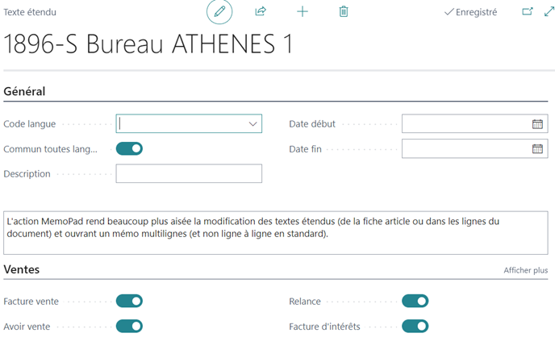

### Lignes attachées
De même, depuis les lignes des documents ventes et achats, l’action MemoPad ouvre la page mémo (la ligne de référence n’est pas reprise dans le mémo) :

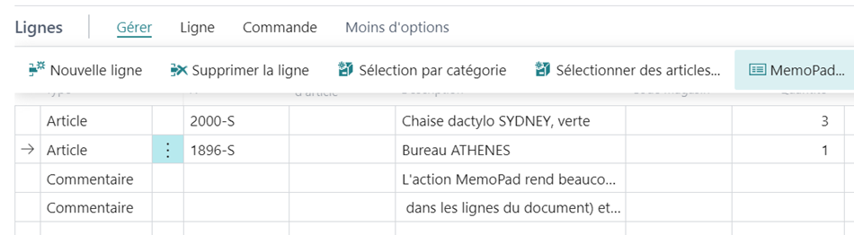

### Impression
Lors de l’impression, les lignes ainsi attachées forment également un mémo unique (non limitée par la longueur de 100 caractères par ligne)  qui peut être placé dans la présentation de document (WordLayout) :

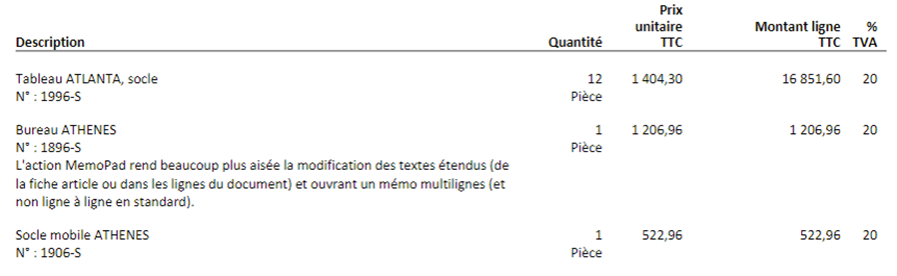

### Relances
La fonction MemoPad est également disponible pour définir les textes de début et fin associés aux niveaux de relance.

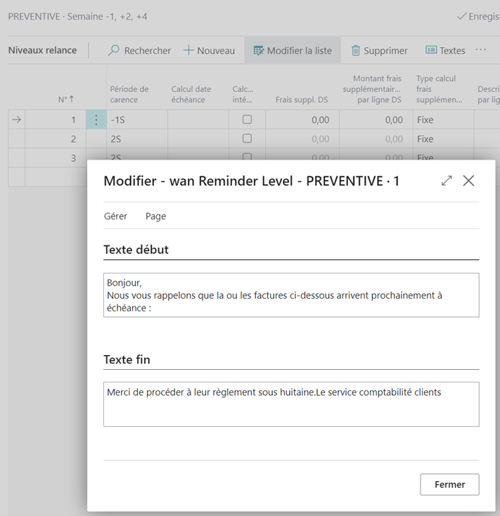

## Export/Import Excel
Les actions des documents de vente et d’achats sont enrichies des fonctions d’export et d’import Excel.

A la différence de l’action **Modifier dans Excel** elles présentent l’avantage d’exporter dans une même cellule les descriptions des lignes attachées (Cf. MemoPad) et, à l’inverse, d’importer vers des lignes attachées les lignes d’une même cellule de description contenant plusieurs lignes et/ou dont la longueur dépasse celle de la **Description**.

Il convient de respecter strictement les colonnes et le nom de la feuille ‘Data’.

## Acomptes
Lors de la validation d’une facture d’acompte, si l’option **Compresser acompte** n’est pas retenue, l’acompte est géré ligne à ligne.

Les colonnes ajoutées aux lignes de la facture enregistrée permettent de l’imprimer sous la présentation suivante (même si la commande étant soldé a été supprimée des commandes en cours) :

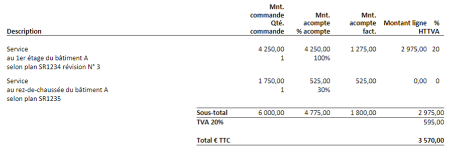

## Commandes-cadres (ventes et achats)
Dans les activités en mode projets/affaires les produits et services sont souvent spécifiques.

Les commandes cadre permettent de définir des lignes personnalisées sans avoir à créer autant d’articles éphémères.

Elles permettent également de définir des conditions propres à un marché (**Bordereaux de Prix Unitaire** ou BPU).

Les lignes de ces commandes cadres pourront être copiées dans les devis, commandes, factures et avoirs.

Quelques articles de type **Service** seront créés pour définir autant de combinaisons de paramètres (groupe compta produit, groupe compta produit TVA, sections analytiques…).

Les désignations (dont textes étendus) et les prix peuvent être personnalisés sur la commande cadre.

### Utilisation sur les documents
Indiquez un **N° commande cadre** en en-tête**.

Depuis les actions des lignes, **Insérer lignes commande cadre** en affiche les lignes.
Celles que vous sélectionnez viendront s’ajouter dans le document.

Si le **N° commande cadre** en entête n’est pas renseigné, les lignes de toutes les commande cadre du client concerné sont proposées.

### Copier lignes cmde. cadre
Cette action ajoutée aux lignes de la facture achat, affiche les lignes des commandes cadre du fournisseur concerné. Les lignes sélectionnées seront ajoutées à la facture.

Il est ainsi possible de définir une commande cadre ‘fictive’ reprenant autant de lignes que de combinaison d’imputations habituellement utilisées.

## Divers
### Libellé écriture
Il figure en en-tête des pages de saisie des documents de vente et d’achat et détermine la **Description** des écritures qui seront générées par la validation

WanaDoc y propose le nom du client / fournisseur (plutôt que le **Type document** et **N° document** qui présentent peu d’intérêt).

### Quantité
En **Paramètres achats** et **Paramètres ventes**, il est possible de choisir **Quantité par défaut de l’article** (qui, comme son nom l’indique, ne s’applique qu’aux lignes de type ‘Article’) :

WanaDoc propose également une **Quantité** de 1 pour les autres types de lignes (sauf ‘Ressources**).
Rien de révolutionnaire mais la saisie des frais généraux (**imputation **Type** ‘Compte général’) est facilitée.

### Document entrant
Si vous disposez d’une solution de reconnaissance de caractère (OCR), la section **Informations financières** reprend les données extraites de la facture du fournisseur.

A défaut, vous pourrez ici les saisir :

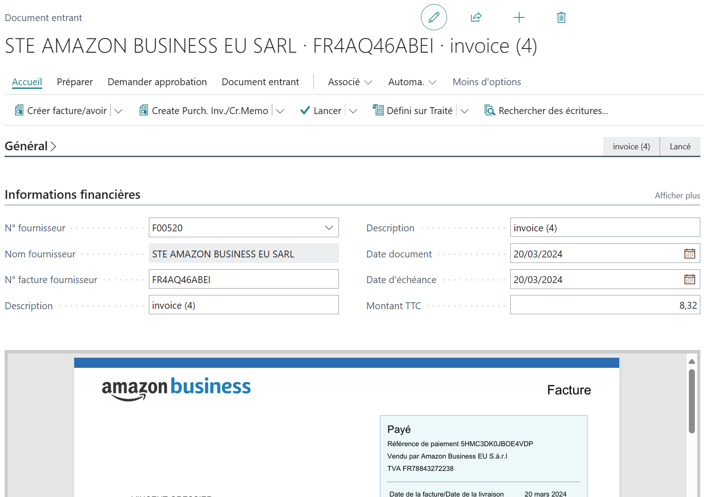

L’action **Créer facture/avoir** reprendra alors ces informations sur le document créé.

Cette même action permet d’afficher le document (facture ou avoir) préalablement créé (mais non validé).

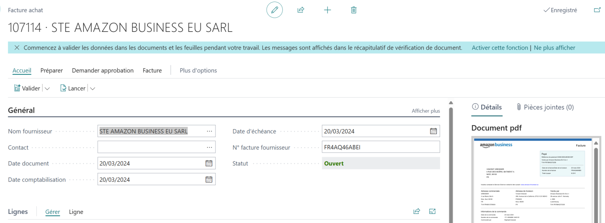

L’extension WanaPdfViewer vous permet quant à elle d’afficher l’image du pdf joint au document entrant, facilitant ainsi le copier/coller.
